# Understanding the interface

[`dataset_viewer()`](https://vthanik.github.io/datasetviewer/reference/dataset_viewer.md)
renders a complete data-exploration surface in one htmlwidget, modelled
on the [SAS
Studio](https://www.sas.com/en_us/software/data-and-ai-studio.html)
table viewer: a column-selection panel, a `PROC CONTENTS`-style property
pane, a names-versus-labels header toggle, header sort, free-text and
type-aware row filters, a reproducible-code view, and CSV export — every
operation running over the **whole** dataset, with no row sampling.

This article is a guided tour of that interface. Each part is shown as
an annotated screenshot with numbered callouts; the [Get
started](https://vthanik.github.io/datasetviewer/articles/datasetviewer.md)
vignette covers the same features as running prose, and
[`?dataset_viewer`](https://vthanik.github.io/datasetviewer/reference/dataset_viewer.md)
documents the R arguments.

The grid below is **live** — drag the scrollbar, resize a column,
right-click a header. Everything described in the rest of this page
refers to this widget. It shows a focused slice of the CDISC pilot ADSL
dataset (the same slice used in the screenshots), supplied by the
companion [`artoo`](https://vthanik.github.io/artoo/) package.

``` r

library(datasetviewer)

cols <- c(
  "USUBJID", "ARM", "AGE", "SEX", "DISCONFL",
  "BMIBL", "RACE", "TRTSDT", "MMSETOT"
)
dataset_viewer(artoo::cdisc_adsl[, cols], view = "labels")
```

## Your first look at the interface

The window divides into a left rail (column tools and metadata), the
data grid, and a thin status bar — the SAS Studio layout.

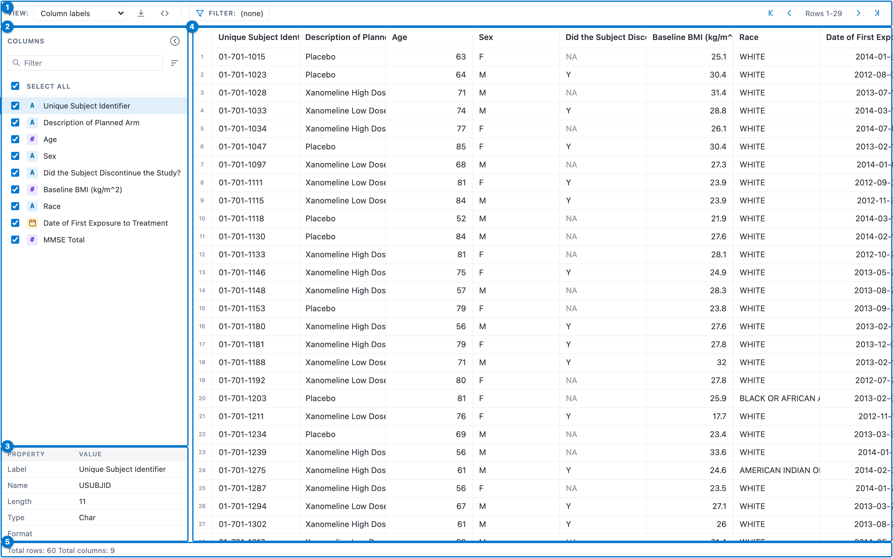

1.  **Toolbar** — the names-versus-labels View dropdown, Export, Show
    code, Filter, and the row pager.
2.  **Columns panel** — a checklist of every column, with type chips and
    tools to sort and search the list.
3.  **Property pane** — `PROC CONTENTS`-style metadata for the selected
    column.
4.  **Data grid** — a canvas grid that draws only the rows you can see,
    so it stays fast at any size.
5.  **Status bar** — total row and column counts, and the filtered count
    once a filter is active.

## The toolbar

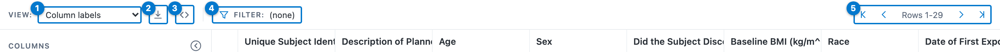

1.  **View** — switch the header row between column **names** and column
    **labels**.
2.  **Export current view to CSV** — download the visible columns,
    current filter, and sort, over every matching row.
3.  **Show code** — reveal the runnable `dplyr` pipeline for the current
    view.
4.  **Filter table rows** — open the free-text filter; the badge shows
    the active expression.
5.  **Row pager** — first / previous / next / last, with the visible row
    range.

## The columns panel

Use the panel to show or hide columns, navigate a wide dataset, and pick
the column whose metadata the property pane shows.

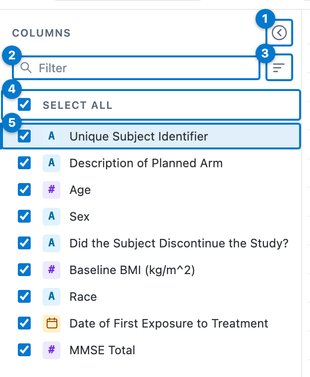

1.  **Collapse** — hide the whole rail and widen the grid (a handle
    reopens it).
2.  **Filter** — type to narrow the list by column name or label; a
    navigation aid only, it never changes the grid’s column order.
3.  **Sort list** — order the list by original position, name, or type.
4.  **Select all** — show or hide every column at once.
5.  **Column row** — a checkbox, a type chip, and the name or label.
    Uncheck to hide the column from the grid (the data is never
    reloaded); click the row to select it for the property pane.

The type chip names each column’s storage kind at a glance:

| Chip | Column type       |
|:----:|-------------------|
| `A`  | Character         |
| `#`  | Numeric           |
|  📅  | Date or date-time |
|  🕑  | Time              |

## The property pane

Selecting a column in the panel fills the property pane with the
attributes `PROC CONTENTS` reports.

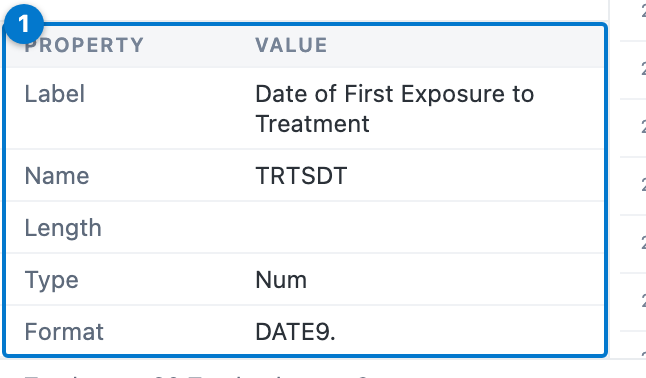

| Field | Meaning |
|----|----|
| **Label** | The descriptive label — a CDISC label when read through `artoo`, otherwise the frame’s `label` attribute. |
| **Name** | The variable name. |
| **Length** | Storage width in bytes for character columns; blank for numeric and date columns, as in SAS. |
| **Type** | `Num` or `Char`. |
| **Format** | The SAS display format (here `DATE9.`) when the frame carries one. |

A plain data frame with no labels shows names only; point the viewer at
a labelled or CDISC-conformed frame and the pane comes to life.

## Names versus labels

The **View** dropdown swaps the header row between variable names and
their labels — useful for clinical data, where the names are terse codes
and the labels are the human-readable description.

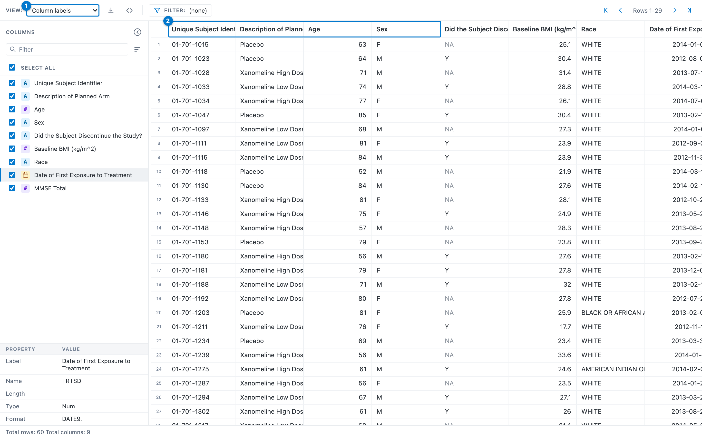

Column labels

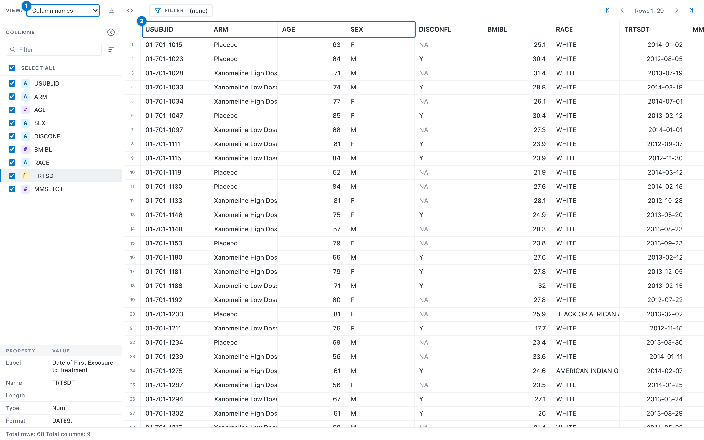

Column names

Start a viewer on either mode with the `view` argument
(`dataset_viewer(x, view = "labels")`).

## Sorting

Click a column header to select it, then click again to cycle its sort:
**ascending → descending → unsorted**. Shift-click further headers to
build a multi-column sort; each sorted column shows its direction and
priority.

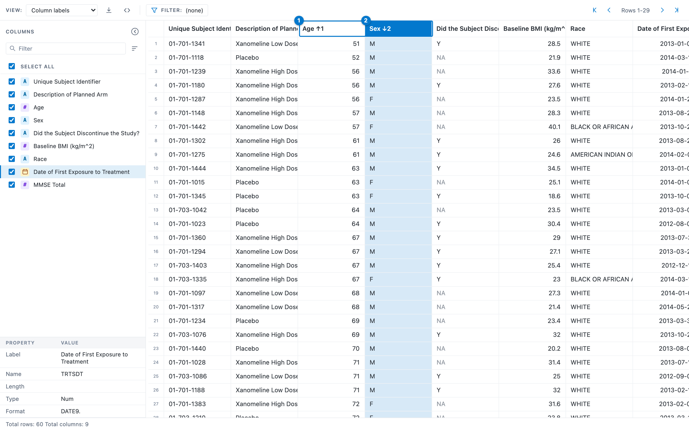

1.  The primary key, ascending — `AGE ↑1`.
2.  The secondary key, descending — `SEX ↓2`. Rows are ordered by age,
    and ties are broken by sex.

> **Tip**
>
> For a multi-column sort, **Shift-click** each additional header. The
> little number beside the arrow (`↑1`, `↓2`) is the sort priority, so
> you can always read the sort order straight off the headers.

## The header menu

Right-click any column header for a per-column menu.

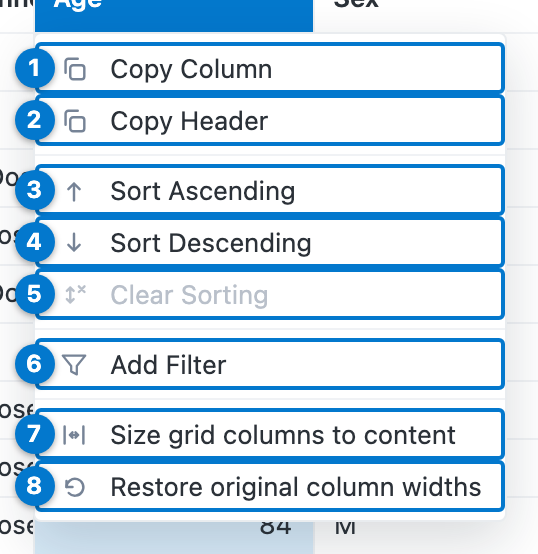

| \# | Menu item | Action |
|:--:|----|----|
| 1 | **Copy Column** | Copy the column’s values to the clipboard. |
| 2 | **Copy Header** | Copy the column’s name (or label). |
| 3 | **Sort Ascending** | Add this column to the sort, ascending. |
| 4 | **Sort Descending** | Add this column to the sort, descending. |
| 5 | **Clear Sorting** | Remove this column from the sort (greyed when the column is unsorted). |
| 6 | **Add Filter** | Open the type-aware filter dialog for this column (below). |
| 7 | **Size grid columns to content** | Auto-fit every column width to its contents. |
| 8 | **Restore original column widths** | Reset every column to the default width. |

## Filtering the whole table

There are two ways to filter, both evaluated in DuckDB over every row,
so the matched count in the status bar is exact — never a count within a
sampled window.

### Filter table rows (free text)

The funnel in the toolbar opens a free-text box. Type a SAS-style
expression; it becomes a SQL `WHERE` clause.

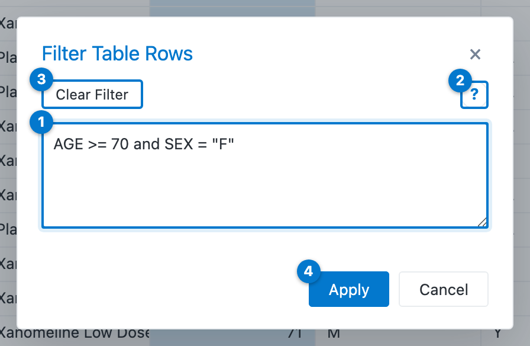

1.  **Expression** — the filter, here `AGE >= 70 and SEX = "F"`.
2.  **Help** (`?`) — the syntax reference.
3.  **Clear Filter** — remove the active filter without closing.
4.  **Apply** — validate and apply; an invalid expression reports
    inline.

The grammar is small:

| Pattern | Example |
|----|----|
| Comparison | `AGE >= 75`, `SEX <> "M"` |
| Logical | `AGE >= 18 and SEX = "F"`, `… or …`, `not …` |
| Set membership | `RACE in ("WHITE", "ASIAN")`, `ARM not in (…)` |
| Missing values | `DISCONFL is na`, `AGE is not na` |
| Text values | single or double quotes — `"AMERICAN INDIAN OR ALASKA NATIVE"` |

### Add Filter (type-aware)

**Add Filter** in the header menu opens a dialog tailored to the
column’s type.

A character (or logical) column offers a checklist of its distinct
values:

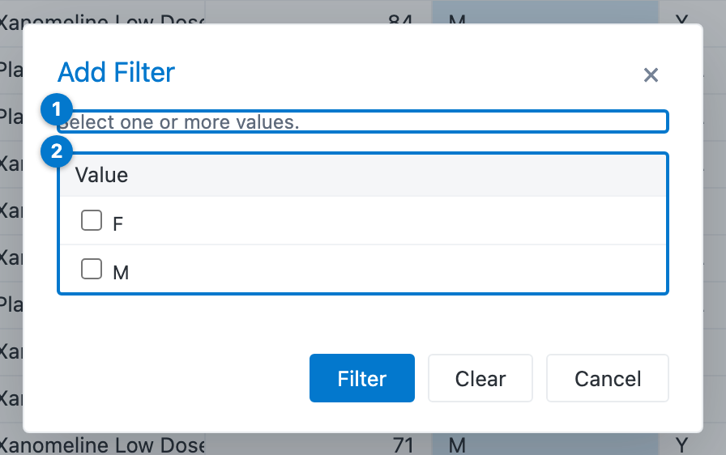

1.  The prompt — select one or more values.
2.  The distinct values, each with a checkbox (plus a **(Missing)**
    entry when the column has any `NA`).

A numeric column offers comparison operators and a value, with a **+**
to add more conditions:

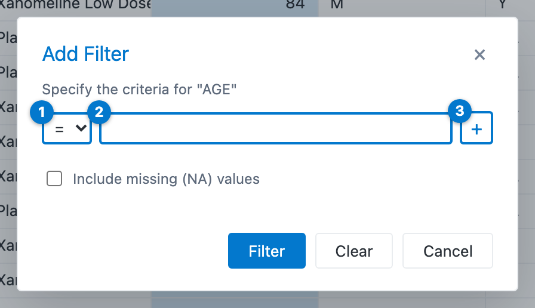

1.  The comparison operator (`=`, `≥`, `>`, `≤`, `<`).
2.  The value to compare against.
3.  **+** — add another condition.

A date, date-time, or time column offers native pickers for equal /
less-than / greater-than:

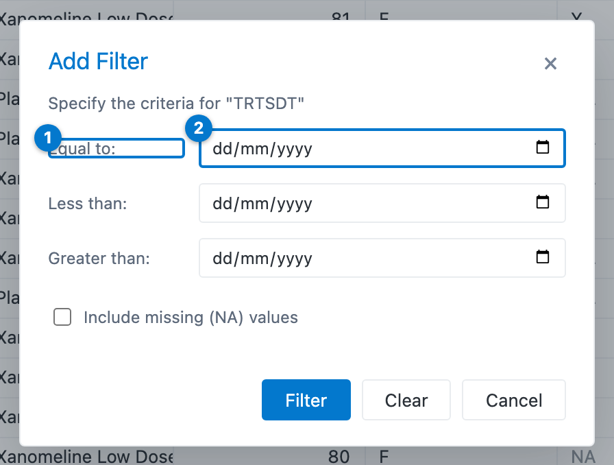

1.  The criterion (Equal to, Less than, Greater than).
2.  A native date picker — date-time and time columns show the matching
    native control.

> **Note**
>
> Every filter — free-text or type-aware — runs over the full dataset in
> the browser, so the status bar’s **Filtered rows** count is the true
> count.

## Missing values

A missing value renders as a muted `NA` in every column, keeping it
distinct both from an empty string and from the floating-point `NaN`
(which renders as `NaN`).

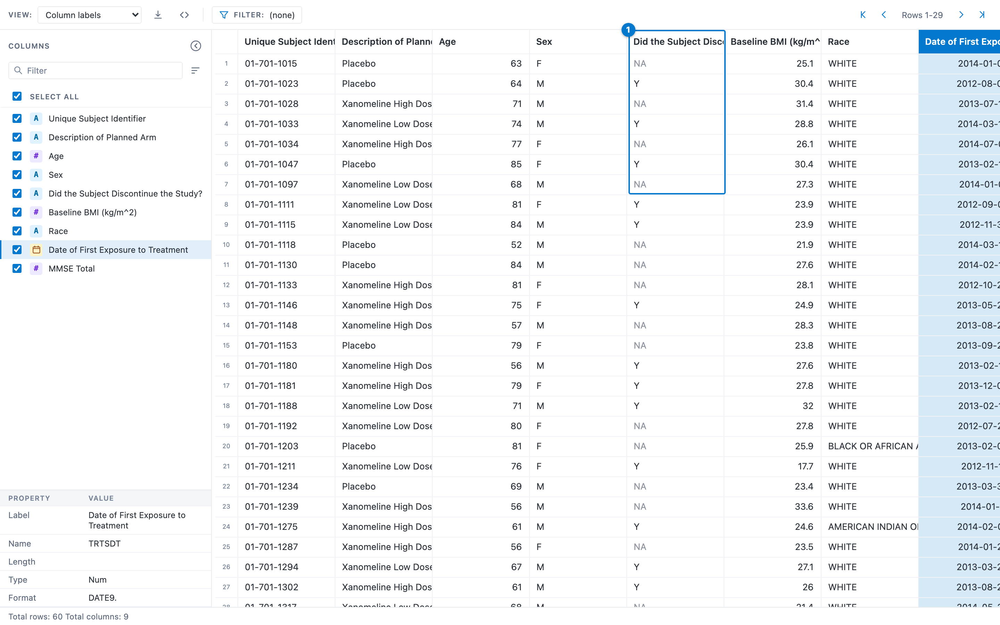

1.  The discontinuation flag, where a muted `NA` sits among the real `Y`
    values.

Filter on missing values with the `is na` / `is not na` free-text
predicate or the **(Missing)** option in the Add Filter dialog; the
generated `dplyr` code uses [`is.na()`](https://rdrr.io/r/base/NA.html).

## Show the code

Exploration in the grid is convenient, but a report must be
reproducible. The **Show code** button opens the runnable, air-formatted
`dplyr` pipeline that reproduces the current view.

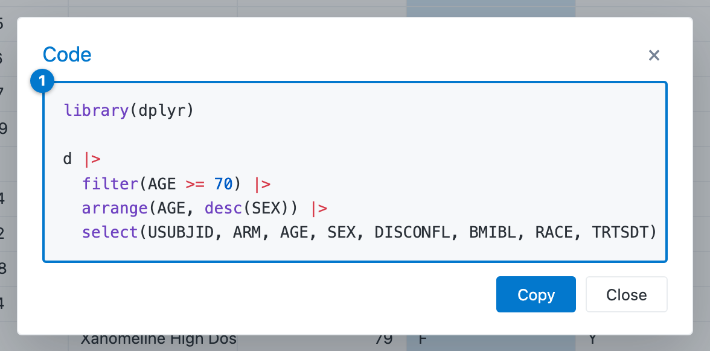

1.  The pipeline:
    [`filter()`](https://dplyr.tidyverse.org/reference/filter.html),
    then
    [`arrange()`](https://dplyr.tidyverse.org/reference/arrange.html),
    then [`select()`](https://dplyr.tidyverse.org/reference/select.html)
    — matching the filter, sort, and column selection currently in the
    grid. **Copy** puts it on the clipboard.

> **Important**
>
> [`select()`](https://dplyr.tidyverse.org/reference/select.html) comes
> **last** so the filter and the sort can reference a column the view
> hides — narrowing first would drop that column before those steps run.

SQL idioms are translated to their R equivalents (`in (…)` becomes
`%in% c(…)`, date and time literals become
[`as.Date()`](https://rdrr.io/r/base/as.Date.html) /
[`as.POSIXct()`](https://rdrr.io/r/base/as.POSIXlt.html) /
[`hms::as_hms()`](https://hms.tidyverse.org/reference/hms.html)), so the
snippet runs as-is against the source frame.

## In a Shiny app

The same widget embeds in Shiny with
[`datasetviewerOutput()`](https://vthanik.github.io/datasetviewer/reference/datasetviewer-shiny.md)
and
[`renderDatasetViewer()`](https://vthanik.github.io/datasetviewer/reference/datasetviewer-shiny.md).
The viewer is not a dead end: the user’s current column selection,
filter, sort, and view mode flow **back** into the app as inputs
(`input$<id>_columns`, `_filter`, `_sort`, `_view`), so the rest of the
app can react to what the analyst is looking at. See the [Get
started](https://vthanik.github.io/datasetviewer/articles/datasetviewer.html#embedding-in-a-shiny-app)
vignette for a complete app.

## Where to next

- [Get started with
  datasetviewer](https://vthanik.github.io/datasetviewer/articles/datasetviewer.md)
  — the same tour as prose, plus the transport/engine architecture and
  offline deployment.
- [`?dataset_viewer`](https://vthanik.github.io/datasetviewer/reference/dataset_viewer.md)
  — the full argument reference (`view`, `width`, `height`).
- [`?datasetviewerOutput`](https://vthanik.github.io/datasetviewer/reference/datasetviewer-shiny.md),
  [`?renderDatasetViewer`](https://vthanik.github.io/datasetviewer/reference/datasetviewer-shiny.md)
  — the Shiny bindings and the inputs the widget publishes.
- [`artoo`](https://vthanik.github.io/artoo/) — CDISC dataset I/O and
  the metadata model the property pane reads.
